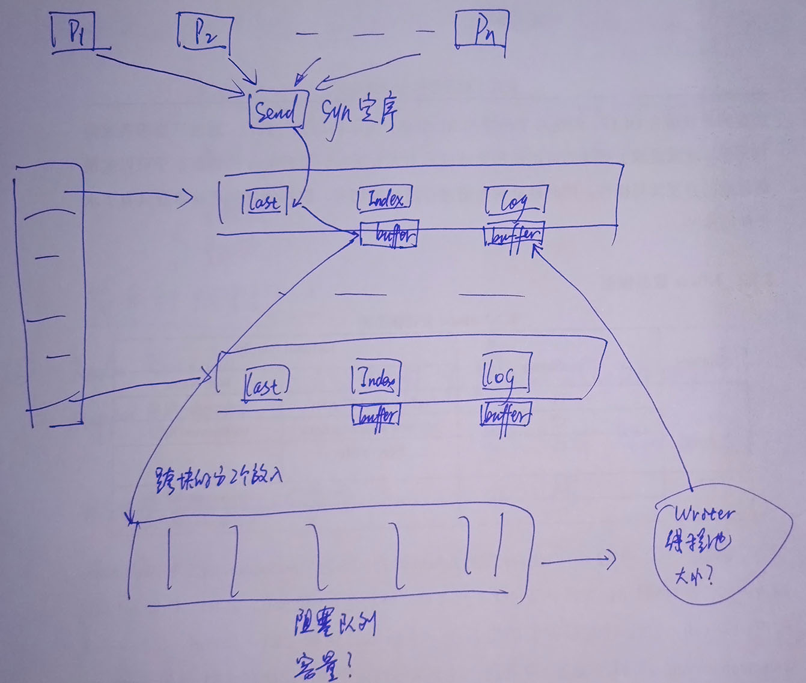
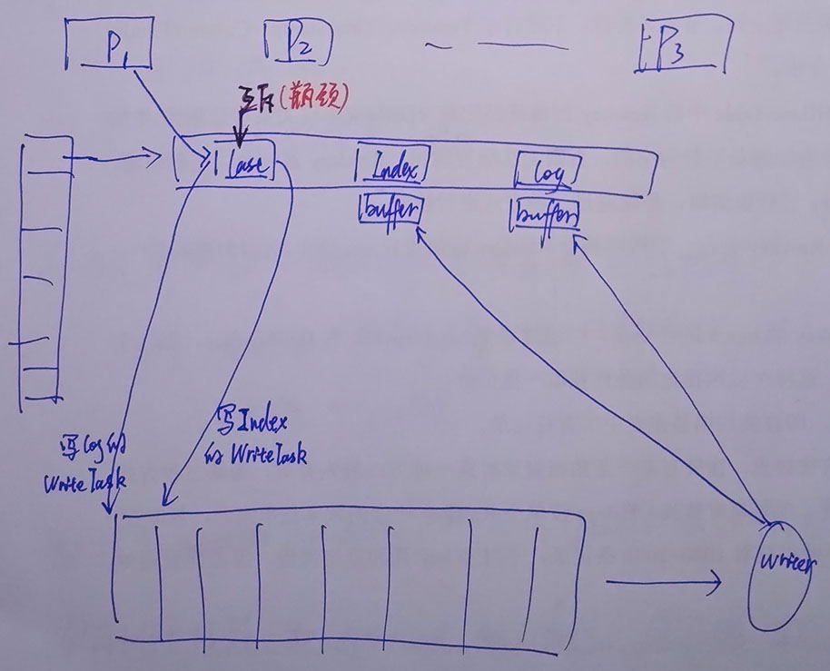

# README

本仓库记录了我于 2017 年 5 月 18 日参加 [阿里中间件性能挑战赛](https://tianchi.aliyun.com/competition/introduction.htm?spm=5176.100068.5678.1.GKQHrY&raceId=231600) 的代码、思考、分享。

原代码是存储在 [阿里云](https://code.aliyun.com/526201447/tianchi_MiddlewareRace/) 上，不太方便，遂迁移到 Github。同时我还整理了一下提交记录：在原提交记录不变的基础上，我将我们的代码演化分为了 5 个阶段，先 merge 到 dev-0 分支，再 merge 到 master 分支并打上 tag。

```sh
*   64a5d64 Merge branch 'dev-0' for Version 5
|\
| *   973dea3 Merge branch 'v5' into dev-0 for v5
| |\_____________________________________________________________ *   d12b9eb last update
| |                                                               ·
* |   fb773e2 Merge branch 'dev-0' for Version 4                  ·
|\|                                                               ·
| *   1c98673 Merge branch 'v4' into dev-0 for v4                 ·
| |\_____________________________________________________________ *   c1bb90b update
| |                                                               ·
* |   848be26 Merge branch 'dev-0' for Version 3                  ·
|\|                                                               ·
| *   f978b17 Merge branch 'v3' into dev-0 for v3                 ·
| |\_____________________________________________________________ *   47e4945 解决 null properties
| |                                                               ·
* |   d4518ac Merge branch 'dev-0' for Version 2.2                ·
|\|                                                               ·
| *   6aa1952 Merge branch 'v2' into dev-0 for v2.2               ·
| |\_____________________________________________________________ *   42e8f4d update
| |                                                               ·
* |   40481c0 Merge branch 'dev-0' for Version 2.1                ·
|\|                                                               ·
| *   6a78304 Merge branch 'v2' into dev-0 for v2.1               ·
| |\_____________________________________________________________ *   0d650f0 refactor
| |                                                               ·
* |   61dce56 Merge branch 'dev-0' for Version 1                  ·
|\|                                                               ·
| *   c59cfdc Merge branch 'v1' into dev-0                        ·
| |\_____________________________________________________________ *   21f578d clean
| |                                                               ·
|/                                                                ·
* be12117 init                                              原比赛时提交记录
```

PS：

* Open-Messaging 框架代码(已集成到本项目)：https://code.aliyun.com/middlewarerace2017/open-messaging-demo [**[备份]**](https://github.com/Will-Grindelwald/tianchi_MiddlewareRace_Third/tree/master/back/)
* 官方提供的测试程序样例(已集成到本项目)：https://code.aliyun.com/middlewarerace2017/openmessagingdemotester [**[备份]**](https://github.com/Will-Grindelwald/tianchi_MiddlewareRace_Third/tree/master/back/)
* 阿里的 RocketMQ(Open-Messaging 规范的来源)：https://github.com/apache/incubator-rocketmq

## 成绩

初赛(第一赛季) 118 名，TPS：17.3w。未进复赛(第二赛季)，初赛前 100 名(最终第一百名 TPS：20.7w)进入复赛。第一次参加比赛，经验不足，中间走了一些弯路，最后已经找到正确优化方向，但时间不够了。

排行榜：https://tianchi.aliyun.com/competition/rankingList.htm?season=0&raceId=231600&pageIndex=6 第 118 名 浑南技校就是我们的队伍。

## 回顾与总结

下面做一下参赛的回顾与总结。

比赛的初赛(第一赛季)于 5.19 开始，我们(我和队友@GQB1226)5.18 才知道的比赛，当即报名，后来才知道，有许多队伍 4 月初就开始作赛题了。:sob:

### Version 1

初始的分工是 @GQB1226 负责生产消息，我负责消费消息。

生产消息：我们使用的 Java MappedByteBuffer，它的底层是内存映射(Linux 上即 mmap)，我和队友都写过 Linux C，知道这应该是最快的了(也查资料验证过)，但我们却本能的低估了它的速度(主观感觉硬盘 IO 太慢，主要还是对由内核控制的换页：缺页中断，脏页替换，理解不够深，这方面知识学习过(我甚至还研究过 Linux 内核)，但没做到学以致用)。因此为了"提高 MappedByteBuffer 的速度"，我们还设计了 MappedByteBuffer 的二级缓存：与 MappedByteBuffer 等长的 byte[] bufferL2，对 bufferL2 并发写(由 Index 确定 message 要写的位置，就不会冲突)，我们还为这个设计内心窃喜，自以为精巧。

消费消息：我设计了 ReadBuffer，将 MappedByteBuffer 封装了一下，一个生产者对应一个 ReadBuffer，同时因为是纯读，不用考虑冲突，所以全程无锁。这个设计用到了最后，只有些细节的改动。

既然要对消息进行持久化，那首先就要考虑 java 对象的序列化问题，我们简单的试验了一下 java 自带的 Serializable，同时查找资料，我们确定 Serializable 是不可行：性能太差劲，序列化后的体积又太大。说实在的最理想的应该是用 json，但题目要求不允许使用第三方库，于是我们自己写了一个序列化/反序列化：类 json，核心就是属性字段的拼接。这个设计也用到了最后，甚至这也是真正优化的方向(见最后)。

可能因为设计太复杂，该版本最终未完成。

### Version 2.1

此时，进入端午假期(5.28~5.30)，队友因早有计划所以陪女友出去玩，单身狗的我面对半瘫的代码，`决定重构`。绕弯路的开始。。。

最终使项目跑了起来，但事实上这一版设计有两个重大失误：

1. 错误理解了题目中的"消息顺序"，题目只要求"生产者内有序"，而我理解成了"全局有序"，为此付出了巨大开销。
1. 没有高并发开发经验的我过多的使用了线程池、阻塞队列，使效率极低。

下为架构图(后期整理，蓝笔为架构设计，红笔为后期评注)


V2.1架构图

本版本虽然运行成功，但是在测评程序中要求的 4000 万数据量在 6 分钟之内是发送不完的，同时会出现 OOM 异常。

### Version 2.2

队友使用了 JProfile 等工具进行性能分析，发现 OOM 异常的原因是在于每个 Topic 的伴生线程，这个设计极其不合理，使我们对多线程有了更深的认识：线程太多切换代价太高。

另一点优化在于：将写文件的动作(Index & Log)抽象出来：WriteBuffer，一个 Topic 一个 WriteBuffer。


V2.2架构图

遗憾的是到此为止，我们依然无法在六分钟之内将 4000 万的数据量发送完，那么问题究竟出在哪里？

### Version 3

6 月 1 日，已经卡在 v2.2 将近一天了，我重新翻开了题目，又一遍仔细的阅读了题目，对于"顺序"忽然有了明悟：保障各发送端的顺序即可!

将代码进行简单的修改：不同生产者对同 Topic 的写入是互斥的，对不同 Topic 写入是并发的。代码性能直接翻了一番!

这时，我们终于在排行榜上有了完整的成绩：4000W 消息量，发送：243141ms，拉取：103335ms，TPS：115448。


V3架构图

红笔的"瓶颈"是当时我们认为的性能瓶颈。然而。。。

### Version 4

当有了第一个完整可运行的系统之后，我们之前的很多想法就可以在这个系统上进行试验了。首先，我们对性能进行了分析，对各部分的时间消耗进行了分析。我们惊讶的发现：我们理所当然认为的性能瓶颈并不是瓶颈，而我们认为性能开销比较大的 write 事实上非常快，而真正的开销是线程的切换以及对阻塞队列的操作。

这些发现使我们有了优化的方向：首先，我们去掉了阻塞队列，然后又去掉了 Writer 线程池，使写 Index 文件以及 Log 文件的操作串行化(也顺便减少了冲突)，当这些做完，我们发现架构变得如此简洁 & 优雅，而且与我们未完成的 Version 1 很相像。。。这也是我说的绕了个大弯。

经过线上测试，我们的结果是：4000W 消息量，发送：150205ms，拉取：84011，TPS：170782。


V4架构图

### Version 5

此时时间已经不多，我们为了进一步提高性能，进行了诸多的测试，因为测试大部分是在线下进行的，代码迭代很快，一旦测试结果不理想，我们就把代码删除了，所以大部分代码并没有保留下来。最终我们唯一对 Version 4 进行的优化就是不再写 Index 文件，直接写 Log，将 Last 整合进 WriteBuffer，为此将 ReadBuffer 也进行了相应的修改。

性能略有提高：4000W 消息量，发送：144415，拉取：85967，TPS：173624。(感觉应该还要再好一点)


V5架构图

现在回忆当时做过的优化测试有：

1. 数据压缩：GZIP & deflate(事后了解这个是可行的，但当时我们的测试太急了，做的不好)
1. 对数据进行缓存：一批数据一个 chunk，批量提交(这个也是可行的，但需要另外的优化)
1. 对 message 的序列化进行改进：方向是对的，但我们没有找到可行的手段。

## 改进

初赛结束后，在官方讨论群中有大神进行了(部分)解密(官方组织的赛后分享在复赛结束后，目前还没有)。

1. 使用 RandomAccessFile or MappedByteBuffer 进行文件读写(我们使用的 MappedByteBuffer)
1. 不要另开线程，线程太多，切换开销太大，就本赛题/消息中间件来说，生产者直接写文件就行(这坑我们踩过了)
1. 消息持久化文件的组织形式：all Topic one file、one Topic one file、one producer one file 皆可(我们采用的 one Topic one file；若是考虑到磁盘寻道的优化，all Topic one file 应该是更好的选择，RocketMQ 就是用的这个方案；最后一种方案 one producer one file，仅就赛题可能性能会有一定提高(生产者不会有任何冲突，自己写自己的文件)，但作为通用程序的话不太好)
1. **提高 PageCache 命中** --> 将数据尽可能多的放到内存里(真正的写盘动作由内核完成，对于我们将数据写到文件的内存映射区就算完了，读数据也尽量从内存读，这样的方案是最快的)，而测试数据量在一般程度的序列化(我们大概就是这水平)后大约 4G，而可供用作 cache 的内存大约 3G，所以必然要压缩
    1. 特殊的序列化：这差不多是许多高分成绩的秘诀? 由 ByteMessage 的特点决定，除了消息体，剩下的消息头 & 消息属性中有很多频繁出现的字段(主要是 /src/main/java/io/openmessaging/MessageHeader.java 中定义的字段)，这些字段是可以通过硬编码(hardcode)来减少序列化后的体积的，甚至 MessageHeader.TOPIC MessageHeader.QUEUE 这俩(的 key 和 value 全都)直接不存，让消费者通过其他途径(目录名/文件名)获得，因为这些是非常高频的字串，特殊序列化后数据体积减少惊人(4G -> 3G，基本满足需要)。至于有些选手通过 hack 测试程序 & 数据，实现了一些非常极端的序列化，比赛中使用没有查出来也就算了，写通用程序是不能这样做的。赛后我总结了一下可取的带 hardcode 的序列化方案：

        Message：msgBodyLen(4byte)+msgBody+msgHeadersLen(2byte)+msgHeaders+msgPropertiesLen(2byte)+msgProperties
        Headers：keyType(枚举 MessageHeader 中的属性)(1byte)+valueType(1byte)+(value(for int long double) or valueLen(2byte)+value(for String))+keyType...
        Properties：keyLen(1byte)+key+valueType(1byte)+(value(for int long double) or valueLen(2byte)+value(for String))+keyLen...

    1. 数据压缩，这个不好做，因为
        1. 要想压缩有效果：就必须等一批数据 chunk 一起做压缩，架构上会复杂化
        1. 有压缩就有解压缩：原本多个消费者可以通过提高 PageCache 命中而快速消费，现在还要实现共享解压后的数据，否则一份数据每个消费者解压一遍，消费性能可能下降得厉害
        1. 做了压缩就很可能将原来的瓶颈从冲突/IO 转移到 CPU，做不好性能更差

## 代码简介

```sh
.
├─back    # 备份的 Open-Messaging 规范源码 及 测试样例代码
├─doc     # Open-Messaging 规范的 javadoc
├─img
├─LOG     # 历次线上测试的 log
└─src
   └─main
       ├─java
       │  └─io
       │      └─openmessaging
       │          ├─demo       # 参赛者的代码目录
       │          ├─exception
       │          ├─filter
       │          ├─internal
       │          ├─observer
       │          └─official
       │              └─tester # 我们根据 测试样例代码 修改的 线下自测代码
       │                  ├─Constants.java      # 测试代码参数
       │                  ├─ConsumerTester.java # 消费者测试代码
       │                  └─ProducerTester.java # 生产者测试代码
       └─resources
```
